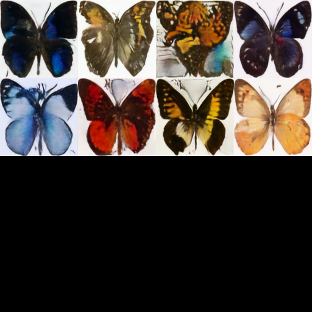
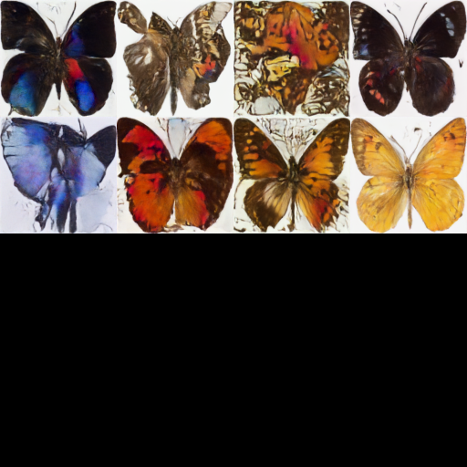

# GAI_project4  
## Training DDPM on Butterfly Dataset  
This project explores optimizing the training process of a Denoising Diffusion Probabilistic Model (DDPM) using a Deep Image Prior (DIP) model.  
By running the Jupyter notebook directly, the results can be reproduced.  

The model transforms randomly generated noisy images into butterfly images.  

## Result after Optimization with DIP  
  

## Result from Original DDPM  
  

As shown, the DIP optimization significantly improves image quality under the same number of epochs.
